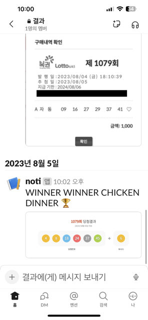

# 로또 자동 구매

## 결과



## 사용법

- 동행복권 홈페이지(https://dhlottery.co.kr/common.do?method=main)에 회원가입이 되어 있고, 예치금이 충전 돼 있어야 됩니다.
- 서버가 켜져있으면 매주 금요일 18시에 로또를 자동번호로 1개(1000원) 구매하게 설정 돼 있습니다.
- https://chromedriver.chromium.org/downloads 에서 크롬 버전에 맞는 드라이버를 다운로드 받아서 프로젝트 루트에 넣어주세요.

```shell
$ git clone https://github.com/pooreumu/lotto-automation.git
$ cd lotto-automation
$ echo USER_ID={{ your id }} >> .env
$ echo USER_PW={{ your password }} >> .env
$ echo SLACK_TOKEN={{ your slack token }} >> .env
$ echo SLACK_CHANNEL_ID={{ your slack channel id }} >> .env
$ npm ci
$ npm start
```
