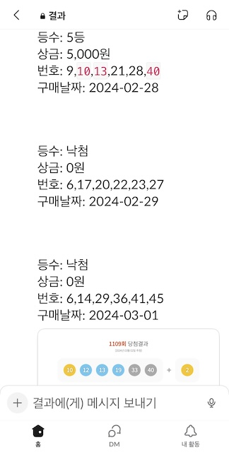

# 로또 자동 구매

## 결과




## 사용법

- 동행복권 홈페이지(https://dhlottery.co.kr/common.do?method=main)에 회원가입이 되어 있고, 예치금이 충전 돼 있어야 됩니다.
- 구매 결과와, 당첨 결과를 받을 슬랙 채널이 필요합니다. ([token 얻기 참고](https://api.slack.com/tutorials/tracks/getting-a-token))
- 당첨번호를 저장할 database PostgreSQL이 필요합니다.

```shell
$ git clone https://github.com/pooreumu/lotto-automation.git
$ cd lotto-automation
$ echo USER_ID={{ your id }} >> .env
$ echo USER_PW={{ your password }} >> .env
$ echo SLACK_TOKEN={{ your slack token }} >> .env
$ echo SLACK_CHANNEL_ID={{ your slack channel id }} >> .env
$ echo DB_HOST={{ your db host }} >> .env
$ echo DB_PORT={{ your db port }} >> .env
$ echo DB_USERNAME={{ your db username }} >> .env
$ echo DB_PASSWORD={{ your db password }} >> .env
$ echo DB_DATABASE={{ your db database }} >> .env
$ npm ci
$ npm start
```
